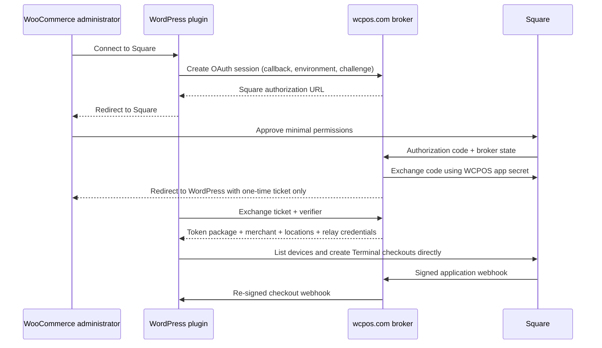

# Square OAuth and Terminal Onboarding Design

**Date:** 2026-07-21  
**Status:** Approved architecture; written specification pending user review  
**Repositories:** `wcpos/square-terminal-for-woocommerce` and `wcpos/wcpos-com`  
**Baseline:** Square Terminal for WooCommerce `v0.2.2`; wcpos.com `main` at `82e2603`

## 1. Problem

The released plugin now renders its Terminal controls, but production terminal
discovery and setup are not implemented:

- the production device list is hard-coded to an empty array;
- the cashier falls back to a free-text device ID;
- the admin "Create Device Code" and "Validate Settings" controls have no
  registered behavior;
- users must create and maintain Square credentials themselves; and
- the plugin does not own the OAuth permissions needed for discovery and
  pairing.

The target experience is one primary **Connect to Square** action. After Square
authorization, the plugin selects or asks for a location, discovers paired
Terminals, guides pairing when necessary, and keeps authorization current.

## 2. Decisions

1. WCPOS will use its own Square application and request only the permissions
   required by this plugin.
2. The plugin will not reuse or copy the official WooCommerce Square plugin's
   access token. It may use that plugin's public environment and location values
   as non-secret setup hints.
3. Existing manually configured installations remain supported and remain in
   manual mode after upgrade. Migration to WCPOS OAuth is optional.
4. The WordPress site calls Square APIs directly with its encrypted access
   token. wcpos.com handles the code-flow secret, OAuth callback, token refresh,
   token revocation, and webhook relay.
5. Polling and the existing reconciliation sweeper remain correctness paths.
   Webhooks reduce latency but are never the only way a paid order becomes paid.
6. Sandbox and production are separate connections with separate credentials,
   locations, devices, caches, and webhook routing.

## 3. Scope

### In scope

- WCPOS Square OAuth application integration for sandbox and production.
- A small wcpos.com OAuth broker and webhook relay.
- Encrypted OAuth credential storage in WordPress.
- Backward-compatible manual credential mode.
- Location discovery and selection.
- Production Terminal discovery through `ListDevices` and Device Codes.
- Terminal pairing through `CreateDeviceCode` and `GetDeviceCode` polling.
- Cashier-side asynchronous device loading with explicit loading, empty, error,
  and retry states.
- Connection validation, disconnect, token refresh, and wrong-account guards.
- Optional non-secret hints from the official WooCommerce Square plugin.
- Automated tests, hosted sandbox verification, release notes, and a new plugin
  release after both companion changes are deployed.

### Out of scope

- Square Orders API itemized-cart integration.
- Application fees.
- A requirement that merchants have a WCPOS account or paid license to connect.
- Importing an access token from any other WordPress plugin.
- Automatically changing settings in the official WooCommerce Square plugin.
- Removing manual-token support.
- Real-time Terminal health as a hard payment prerequisite. Square's device
  monitoring data can be delayed; an apparently offline device may still be
  usable.

## 4. Required Square permissions

The WCPOS Square application requests exactly:

| Permission | Use |
|---|---|
| `MERCHANT_PROFILE_READ` | Merchant identity, locations, currency, and wrong-account checks |
| `PAYMENTS_READ` | Verify payments returned by completed Terminal checkouts |
| `PAYMENTS_WRITE` | Create and cancel Terminal checkouts |
| `DEVICES_READ` | List paired Terminal API devices and monitoring status |
| `DEVICE_CREDENTIAL_MANAGEMENT` | Create and poll Device Codes for pairing |

No catalog, customer, inventory, order, settlement, bank-account, or
application-fee permission is requested.

Primary references:

- [Square OAuth permissions](https://developer.squareup.com/docs/oauth-api/square-permissions)
- [Square OAuth overview](https://developer.squareup.com/docs/oauth-api/overview)
- [ListDevices](https://developer.squareup.com/reference/square/devices-api/ListDevices)
- [Terminal pairing](https://developer.squareup.com/docs/terminal-api/pos-integration)

## 5. System architecture



The Square application secret and Square webhook signature keys exist only on
wcpos.com. OAuth access and refresh tokens are never placed in a browser URL.
The plugin stores them encrypted and sends the refresh token to wcpos.com only
over a server-to-server refresh request.

## 6. wcpos.com broker

### 6.1 Endpoints

The broker exposes environment-aware endpoints under the versioned protocol
root `/api/integrations/square/v1`. The plugin checks the advertised protocol
version before showing Connect; unsupported versions fail closed while manual
mode remains usable.

| Endpoint | Purpose |
|---|---|
| `GET /capabilities` | Return protocol version and production/sandbox availability without secrets |
| `POST /sessions` | Validate the WordPress callback, store a short-lived OAuth handshake, return the Square authorization URL |
| `GET /callback` | Verify broker state, exchange Square's authorization code, create a one-time ticket, redirect to WordPress |
| `POST /exchange` | Atomically consume the ticket after verifier proof and return the token package |
| `POST /refresh` | Validate the WCPOS connection credential, idempotently refresh the Square token, return rotated credentials |
| `POST /disconnect` | Idempotently transition one WCPOS connection through token cleanup to revoked and remove relay registration |
| `POST /heartbeat` | Refresh the webhook routing registration and report broker health |
| `POST /webhooks/{environment}` | Verify the Square application webhook, route and re-sign supported events |

All JSON responses use a stable envelope:

```json
{
  "ok": false,
  "code": "stable_machine_code",
  "message": "Safe administrator-facing message",
  "retryable": false
}
```

No Square token, authorization code, verifier, raw Square error body, or WCPOS
connection credential is logged.

### 6.2 OAuth handshake

1. The plugin generates a 32-byte `client_state` and a 32-byte verifier and
   stores both in a non-autoloaded, ten-minute WordPress transient tied to the
   initiating administrator and environment.
2. `/sessions` accepts the environment, fixed WordPress callback URL,
   `client_state`, and SHA-256 verifier challenge. It accepts no caller-supplied
   Square scopes.
3. wcpos.com validates the callback as HTTPS, rejects credentials, fragments,
   IP literals, non-public destinations, redirects, and non-standard production
   ports, then stores the handshake encrypted in Redis with a ten-minute TTL.
   Localhost is allowed only for the broker's non-production environment.
4. The broker sends Square a random, single-use broker state and the fixed
   WCPOS Square redirect URI. Production authorization sets `session=false` so
   an existing Square browser session cannot silently select an account.
5. `/callback` atomically consumes broker state before exchanging Square's
   authorization code. It verifies that Square granted every required scope,
   retrieves merchant and active-location data, encrypts the resulting package,
   and stores it behind a random five-minute ticket.
6. The browser is redirected to the original WordPress callback with only the
   one-time ticket and `client_state`.
7. WordPress verifies the stored state, then `/exchange` atomically consumes the
   ticket only after the original verifier is supplied. Reuse returns a generic
   expired-ticket response.
8. The exchanged connection remains pending locally. WordPress displays the
   Square merchant identity and selected or eligible location, and the
   administrator must choose **Use this Square account** before it becomes the
   active connection. Rejection disconnects the pending connection.

The callback never accepts a free-form return URL from Square. It uses only the
validated callback stored in the consumed handshake.

### 6.3 Connection credential and refresh

The exchange response contains a WCPOS-signed connection credential binding:

- a random connection ID;
- Square merchant ID;
- environment;
- normalized WordPress site origin; and
- a monotonic connection generation; and
- issue time and key ID.

It is not a Square token. The plugin must present it to refresh, disconnect, and
heartbeat endpoints. The credential is audience-restricted to this broker and
has a bounded lifetime renewed during token refresh. Signing supports an active
and previous key so broker-key rotation does not disconnect every merchant.

The plugin refreshes at least once every seven days and before the Square access
token expires, and retries once on an authentication-expired API response. One
per-environment WordPress mutation lock serializes refresh, OAuth activation,
reconnect, method switch, location/credential mutation, and disconnect. Every
request and response carries the connection ID and generation. WordPress saves
a response only with compare-and-swap against the exact generation that began
the operation, so a delayed refresh cannot overwrite a disconnect or newer
connection.

Each refresh carries a client-generated idempotency key retained until the new
encrypted record is durably saved. Under a per-connection broker lock, the
broker obtains the new token, persists an encrypted replay result and cleanup
state by connection/idempotency key, then revokes the superseded access token
with `revoke_only_access_token=true`. It returns the new access token only after
that revoke succeeds. A lost response returns the same persisted result instead
of refreshing twice. WordPress acknowledges the operation only after its new
encrypted record is durably saved; until then, retries return the same result.
The replay record is deleted on acknowledgement and otherwise expires no sooner
than the returned access token. An expired or missing replay record fails closed
and requires reconnect rather than issuing an untracked token.

The response contains the latest access token, expiry, refresh token when Square
rotates it, renewed WCPOS connection credential, and current relay verification
key set. This two-phase protocol maintains the invariant that, outside a locked
refresh/disconnect operation, the broker knows of exactly one live access token
for the connection.

### 6.4 Durable connection authorization registry

The broker keeps an authoritative, no-TTL connection registry in Upstash Redis:

```text
connection_id -> generation, merchant_id, environment, normalized site origin,
                 active|disconnecting|revoked, operation_id,
                 created_at, revoked_at, last_seen
```

The durable registry stores no Square token; encrypted tokens exist only in the
bounded refresh/disconnect operation ledger described above. `/exchange`
atomically creates generation one. Refresh and heartbeat require an existing
`active` record whose origin,
merchant, environment, and generation match the signed credential. The first
disconnect atomically changes `active` to `disconnecting` and records its stable
operation/idempotency key. Only retries presenting that exact key can continue
the operation; all other refresh, heartbeat, and disconnect requests fail
closed. After token cleanup succeeds, the broker finalizes `revoked` and stores
an idempotent success result. A missing record, Redis outage, revoked status on
any other operation, or stale generation fails closed. Registry backups and
availability alerts are release requirements; data loss disconnects managed
sites rather than allowing an old refresh token to regain access.

An ordinary site disconnect sends the locally held current access token only in
that authenticated server-to-server request. The broker stores it encrypted in
the bounded disconnect operation record, enters `disconnecting`, and calls
Square `RevokeToken` with `revoke_only_access_token=true`. The same operation key
can safely retry after a timeout or process restart. The operation also waits
for every refresh that entered the per-connection lock earlier: if one returns a
new token after `disconnecting` was selected, the broker immediately revokes
that new token and records cleanup before the disconnect can finalize. Once all
known tokens are revoked, it erases operation secrets and marks `revoked`.

The broker never uses Square's default seller-wide revocation for this action
because one merchant can connect several WordPress sites. The durable revoked
record permanently blocks that connection's still-valid code-flow refresh token
at the broker. A Square `oauth.authorization.revoked` event marks every
connection for that merchant and environment revoked. Seller-wide revocation
remains an explicit Square Dashboard action, not the meaning of the plugin's
per-site Disconnect button.

Refresh and disconnect serialize on the registry record and operation ledger.
If refresh finishes at Square after disconnect begins, the broker revokes its
new token before returning revoked; it never merely discards an issued token.
WordPress independently rejects any delayed response whose generation is no
longer current.

### 6.5 Webhook relay registry

The plugin never attempts to create a Square webhook subscription. Square's
Webhook Subscriptions API is application-scoped and requires the application's
personal access token, so the WCPOS application webhook is configured once by
the operator.

Separate from the durable authorization registry, the broker keeps cache-like
webhook routing metadata in Upstash Redis, never Square OAuth tokens:

```text
connection_id -> merchant_id, environment, normalized callback URL, last_seen
```

The entry has a 35-day TTL. The plugin refreshes it daily and during connection
validation. If a webhook contains a syntactically valid connection ID backed by
an active durable authorization record but its route is missing, the broker
returns retryable `5xx` and requests route repair; the next heartbeat self-heals
it. A genuinely unknown or revoked connection is acknowledged after safe
logging. Browser polling and the WordPress sweeper remain the correctness
fallback.

OAuth-mode checkout references use:

```text
sq_<22-character-routing-id>_<base36-order-id>
```

The routing ID is the full base64url encoding of a random 128-bit connection ID,
not a truncated lookup key. A 64-bit WooCommerce order ID needs at most 13
base36 characters, keeping the reference at or below 39 characters and within
Square's 40-character limit without relying on a cache-backed collision check.
Manual-mode and pre-upgrade attempts retain `woocommerce_order_<id>`. The
reconciler accepts both formats but accepts an OAuth reference only when its
routing ID matches the attempt's recorded connection.

The broker verifies Square's signature against the exact registered wcpos.com
notification URL and raw body. It routes only `terminal.checkout.updated` in
the first release. Pairing uses `GetDeviceCode` polling, and payment verification
uses `GetPayment`, so device and payment webhooks are unnecessary.

Before forwarding, it verifies:

- the reference contains a valid 128-bit connection routing ID;
- the registry entry exists and matches webhook merchant and environment;
- the destination is still HTTPS and public after a fresh DNS lookup;
- the outbound connection is pinned to that validated public address while
  preserving the expected TLS server name and Host header; and
- redirects are disabled.

The forwarded request includes connection ID, Unix timestamp, event ID, relay
key ID, and an HMAC over timestamp, connection ID, callback path, and raw body.
The per-site HMAC key is derived with versioned HKDF key material and the full
connection ID. `/exchange`, `/refresh`, and authenticated `/heartbeat` responses
distribute the active key ID/key and, during rotation, the previous key ID/key
plus its exact acceptance deadline. The plugin atomically retains that bounded
two-key set, allowing rollout and rollback without retaining old broker masters
indefinitely. WordPress rejects unknown or expired key IDs and timestamps
outside five minutes and continues to deduplicate Square event IDs.

Network, timeout, `429`, and site `5xx` failures return `5xx` to Square so its
normal retries apply. A verified duplicate returns `2xx`. Unknown or revoked
connections and permanent site `4xx` responses are logged without secrets and
acknowledged to avoid a retry storm; a missing cache route for a known active
connection is retryable as described above.

### 6.6 Broker abuse controls

- Separate production and sandbox Square credentials, redirect URLs, webhook
  keys, rate-limit prefixes, and Redis key prefixes.
- Per-IP and per-callback-origin limits on session creation, exchange, refresh,
  and heartbeat.
- Constant-time verification for state, verifier challenge, and HMACs.
- Maximum request and response sizes and short outbound timeouts.
- No forwarding to private, loopback, link-local, multicast, carrier-grade NAT,
  or reserved IPv4/IPv6 ranges. Each attempt resolves once, rejects the
  destination if any A or AAAA result is non-public, selects a validated address,
  and pins the connection to it while preserving canonical Host and TLS SNI.
  Retries repeat resolution and pinning. The transport ignores environment proxy
  settings, preventing both DNS rebinding and proxy-based SSRF.
- No redirects on callback validation or webhook forwarding.
- Sentry/Loki events contain connection ID, environment, merchant hash, and
  stable error code, never merchant tokens or raw request bodies.

## 7. WordPress connection model

### 7.1 Per-environment state

Each environment has an explicit active method:

```text
manual | oauth | unconfigured
```

Immutable manual and OAuth connection records live in a dedicated non-autoloaded
option rather than being selected directly from the WooCommerce gateway
settings array. OAuth records contain encrypted access token, encrypted refresh
token, expiry, encrypted WCPOS connection credential, encrypted relay keys,
merchant ID/name, selected location ID/name/currency, granted scopes, connection
routing ID, broker generation, local generation, status, and last
validation/heartbeat times. Manual records contain the encrypted token,
environment, location/webhook identity, a non-secret credential fingerprint,
local generation, and status.

Records are keyed by full connection ID, with a separate per-environment active
pointer. A superseded connection becomes `retired`, not deleted, while any open
or abandoned attempt references it. The connection service can resolve a client
by the attempt's immutable connection ID and generation, not just by the active
pointer. Retired records keep refresh capability and can reconcile or cancel
only their recorded attempts; they cannot create new checkouts. They are revoked
and deleted only after the attempt index proves no open or abandoned checkout
depends on them. The admin displays this state rather than claiming
disconnection is complete.

There is no automatic credential fallback. If OAuth is selected and invalid,
payments stop with a clear connection error rather than silently charging a
saved manual account.

### 7.2 Encryption

Managed OAuth is available only when OpenSSL authenticated encryption is
available. The plugin derives a 256-bit, site-specific key from WordPress
authentication salts and the normalized site origin and stores a random nonce
and authentication tag with each secret. It never invents or persists a second
plaintext key.

If salts or site origin change and decryption fails, the connection is marked
unreadable, no Square request is made, and the administrator is asked to
reconnect. The failure is logged without ciphertext or secret material.

Tokens and connection credentials are:

- never localized into JavaScript;
- never rendered back into password fields;
- never included in order notes or debug logs; and
- redacted by key name and high-entropy-value checks in the plugin logger.

### 7.3 Credential provider boundary

All Square client creation uses one connection service. New checkout and device
operations request the active environment, access token, location, merchant
identity, method, connection ID, and generation. Attempt reconciliation instead
requests the exact immutable connection ID and generation stored on that
attempt. Callers do not read `production_access_token`,
`sandbox_access_token`, or OAuth options directly.

The service has two providers:

- **Manual provider:** existing settings and direct Square credentials.
- **OAuth provider:** encrypted managed connection with locked refresh.

This boundary prevents checkout, device, admin, webhook, and sweeper paths from
choosing credentials differently.

## 8. Existing-manual-user migration

Upgrade is non-destructive:

1. If an environment has a saved manual token and no explicit method, import it
   once into an encrypted immutable manual connection record and set that
   environment's method and active pointer to that record.
2. Copy the legacy shared `location_id` only to the environment active at
   migration time. Do not guess the other environment's location.
3. Copy the legacy shared direct-webhook URL and signature key only to the
   environment active at migration time; preserve the legacy fields for
   rollback and do not guess the other environment.
4. Keep legacy values while manual remains active so a failed update can roll
   back without losing payment configuration.
5. Mask saved manual token fields. Blank form submissions preserve the current
   token; replacement requires an explicit new non-placeholder value.
6. Existing manual checkout, polling, direct webhook, and sweeper behavior
   continues unchanged.

On the first successful activation of managed OAuth, the plugin confirms the
manual import, then blanks the legacy token, location, and webhook secret fields
that `v0.2.2` reads directly. The encrypted manual record remains available for
an explicit switch back. This makes a code-only downgrade while OAuth is active
fail closed instead of silently charging the old manual Square account.

A safe downgrade requires: reconcile all open attempts, explicitly switch back
to a validated manual record, and only then install the old version. That switch
repopulates the legacy manual fields from the selected record. The UI and release
notes state that downgrading directly from active OAuth is unsupported and will
disable Square payments.

Manual tokens that permit `ListDevices` and Device Code calls receive the new
discovery and pairing UX. If a manual token lacks those permissions, the admin
shows the exact missing capability and the cashier retains the existing manual
device-ID fallback. OAuth mode never exposes the free-text fallback.

### Optional switch to OAuth

The settings panel shows **Switch to managed Square connection**. During the
flow, manual credentials remain active. Only after OAuth exchange, scope
validation, merchant retrieval, location selection, a successful Square API
validation, and explicit **Use this Square account** confirmation does the
plugin atomically select OAuth. A merchant-ID change from a validated manual or
OAuth record is labelled as an account switch and requires a second explicit
confirmation after the open-attempt guard passes. Existing open attempts keep
their original connection record and credentials until final reconciliation;
they never switch providers because an administrator changed the active method.

Saved manual credentials remain inactive and masked for explicit rollback.
They are never selected automatically. The administrator can explicitly
reactivate manual mode or delete saved manual credentials.

If OAuth is cancelled or fails, the active method and manual credentials are
unchanged.

## 9. Official WooCommerce Square hints

When the official plugin is active and initialized, this plugin may call its
public settings handler to read only:

- connected/disconnected state;
- sandbox/production environment; and
- selected location ID.

It must not read, copy, log, store, or display the official plugin's access or
refresh tokens. After WCPOS OAuth returns locations, an official-plugin
location is auto-selected only when that exact ID exists in the newly
authorized merchant account. Otherwise it is ignored.

Failure or API changes in the official plugin are silent hints failures and
must never block WCPOS setup.

## 10. Location onboarding

After a connection is exchanged or validated:

1. Fetch all Square locations with the active credential.
2. Keep active locations that can process the WooCommerce store currency.
3. If the official WooCommerce Square location hint exactly matches, select it.
4. Otherwise, auto-select the sole eligible location.
5. If several remain, require one explicit selection before enabling payments.
6. If none remain, keep the connection but disable payment and explain the
   location/currency problem.

Changing location invalidates cached devices and the saved default Terminal.
OAuth merchant ID, location ID, and environment are included in connection
validation so a wrong account cannot silently reuse another account's device
or cache.

## 11. Terminal discovery

### 11.1 Provider reads

Production discovery uses both Device Codes and `ListDevices`:

- Device Codes supply the Terminal checkout `device_id` produced by Terminal
  API pairing.
- `ListDevices` supplies monitoring name/model/status and physical manufacturer
  ID. Its `Device.id` value includes a `device:` prefix and is a monitoring API
  ID; it must not be blindly sent as `DeviceCheckoutOptions.device_id`.
- Join records by Device Code `device_id` and the monitoring device's physical
  manufacturer/serial ID where possible. When monitoring data is absent, a
  paired Device Code remains selectable using its own `device_id`.
- A selectable Device Code must have status `PAIRED`, a non-empty `device_id`,
  `product_type: TERMINAL_API`, and the exact active location. A monitoring-only
  `ListDevices` record with no qualifying Device Code for the active WCPOS
  application is informative but not selectable. This prevents a Terminal
  paired to another application from appearing usable in WCPOS.
- Multiple historical Device Codes for the same checkout `device_id` are
  deduplicated, preferring the newest qualifying record. Expired, unpaired,
  unknown-status, empty-ID, wrong-product, and wrong-location records are never
  selectable. `Device.attributes.manufacturers_id` enriches display only and
  never replaces the Device Code's checkout ID.

This distinction is covered by tests because confusing the monitoring ID with
the checkout ID would make discovery appear successful while every payment
fails.

### 11.2 Cache and response

The server exposes an order-authorized AJAX discovery action for the cashier
and a capability/nonce-protected action for admin settings. It:

- filters by selected location;
- follows pagination independently for Device Codes and `ListDevices`;
- caches normalized devices for five minutes by environment, merchant, and
  location;
- bypasses the cache immediately after pairing or location changes;
- uses an eight-second provider timeout; and
- returns safe normalized fields only: checkout device ID, name, model,
  monitoring status, updated time, and location ID.

Square monitoring data can be delayed. `OFFLINE` and `NEEDS_ATTENTION` are
visible warnings, not irreversible exclusions. The cashier may deliberately
select the device and let Terminal API return the authoritative result.

Sandbox continues to use Square's documented magic device IDs and performs no
pairing or `ListDevices` call.

## 12. Terminal pairing

When production has no paired Terminal—or when the administrator chooses
**Pair another terminal**—the settings UI:

1. Uses the selected location and asks only for an optional human name.
2. Creates a Device Code with `product_type: TERMINAL_API` and a unique
   idempotency key.
3. Displays the short code, exact expiry, and on-device instructions.
4. Polls `GetDeviceCode` with chained timeouts until `PAIRED` or expired.
5. On `PAIRED`, captures `DeviceCode.device_id`, invalidates discovery cache,
   refreshes the Terminal list, and selects the new device.
6. On expiry, offers **Generate a new code** without leaving the page.

Closing the page does not corrupt setup. A later device-list refresh discovers
the paired Terminal. Dashboard-generated device codes are never accepted as a
pairing substitute.

## 13. Admin experience

The gateway settings show one connection panel for the selected environment:

### Unconfigured

- Primary: **Connect to Square**.
- Secondary collapsed section: **Use manual credentials**.

### OAuth connected

- Merchant, environment, location, last validation, and Terminal count.
- **Change location**, **Pair another terminal**, **Reconnect**, and
  **Disconnect** actions.
- Manual credentials remain in Advanced, inactive and masked when they exist.

### Manual connected

- Label: **Connected manually**.
- Primary recommendation: **Switch to managed Square connection**.
- **Validate**, device discovery/pairing when permitted, and manual webhook
  fields remain available.

Every async action has a loading state, disables duplicate submission, and
renders a stable safe error plus Retry. Debug details go only to redacted logs.
No remote mutation occurs merely because the settings page rendered.

## 14. Cashier experience

When Square Terminal is selected, the payment panel initializes as follows:

1. Sandbox devices are rendered immediately from local configuration.
2. Production shows **Loading Square terminals…** and sends the authorized
   device-list AJAX request.
3. On success, render Terminal names with warning/status text and restore the
   browser's last-used choice only if it still exists at the selected location.
4. With one healthy device and no saved choice, select it automatically.
5. With several devices, require an explicit selection.
6. With no devices, show **No paired terminals** and an administrator-only link
   to pairing; do not show a blank input in OAuth mode.
7. On a retryable request failure, show **Could not load terminals** and Retry.
8. The existing Start, Check Status, Cancel, detach, reload-resume, and
   reconciliation state machine remains unchanged after a device is selected.

Device names are inserted using `textContent`, and device responses contain no
credentials. The device-list action uses the same order-access contract as the
existing payment actions so an unrelated visitor cannot enumerate store
hardware.

## 15. Disconnect and rollback

OAuth disconnect runs under the environment mutation lock. After the
open-attempt guard passes, the broker atomically enters `disconnecting` under a
stable operation key and begins revoking every known token. WordPress
immediately removes the active pointer and marks the local record
`revocation_pending`; the connection service can no longer use it for Square
operations. It retains the encrypted access token only so the same idempotent
disconnect operation can finish the Square revoke, then erases the record,
device cache, and relay keys. A lost success response is safe to retry.

If Square revocation remains unavailable, **Forget local retry data** requires
confirmation and explains that the current access token can remain valid until
expiry, although the broker `disconnecting` or `revoked` record permanently
blocks refresh. The merchant
can revoke the entire WCPOS application in Square Dashboard, which also
disconnects every other site using that merchant authorization. A merchant-wide
`oauth.authorization.revoked` event makes all matching local connections fail
closed on their next broker interaction.

Disconnect or replacement is blocked from revoking a connection while its
recorded open or abandoned attempts remain. The administrator may first force
status reconciliation and cancel or detach as appropriate. A forced
merchant-wide revoke marks every affected order for manual review because final
reconciliation is no longer guaranteed. If an active connection is replaced,
the old record follows the retired-connection rules in section 7.1; this makes
the old-attempt identity guarantee below operational rather than aspirational.

The same open-attempt guard applies to replacing or deleting a manual token,
changing its environment/location, deleting inactive rollback credentials, or
changing a direct-webhook identity. A manual attempt records a non-secret
credential fingerprint and is reconciled only by the matching retained manual
configuration. This prevents a settings edit from sending an old checkout ID
to a new merchant account.

Switching back to saved manual credentials is explicit and requires successful
manual validation before the active method changes. No checkout in progress is
migrated between credentials. Open attempts continue using the connection
identity recorded when they were created until reconciliation reaches a final
state.

The plugin release is deployed only after the compatible broker endpoints are
live. The plugin treats broker unavailability as follows:

- existing unexpired access tokens continue direct Square API operation;
- refresh/connect/disconnect/heartbeat show retryable errors;
- webhook loss falls back to polling and sweeper reconciliation; and
- manual mode is unaffected.

## 16. Data and identity safety

- Every checkout attempt records connection method, environment, merchant ID,
  location ID, and full OAuth connection routing ID alongside the existing
  attempt metadata.
- Status, cancel, detach, webhook, and sweeper paths use that recorded identity
  and reject a response from a different recorded connection, even when the
  attempt's connection has since become retired.
- Changing credentials does not make an old checkout belong to the new account.
- One per-environment mutation lock and generation compare-and-swap protects
  refresh, activation, reconnect, method switch, settings mutation, and
  disconnect from stale responses.
- OAuth callback, token exchange, refresh, and settings mutations require
  `manage_woocommerce`; payment and device enumeration use existing order
  access and nonce rules.
- Broker-to-site webhooks use a distinct WCPOS signature scheme and REST route;
  direct Square webhooks for manual mode continue using Square's signature and
  existing route.
- All remote operations have stable idempotency, timeout, and retriable/error
  classifications.

## 17. Testing and verification

### wcpos.com unit and route tests

- session callback validation, state expiry, state replay, and verifier failure;
- no caller-supplied scope escalation;
- callback never places Square secrets in redirect URLs;
- one-time ticket atomic consumption and replay rejection;
- production authorization always sets `session=false`;
- durable connection creation, generation checks, `disconnecting`/`revoked`
  transitions, missing-record fail-closed behavior, and merchant-wide
  authorization-revoked handling;
- two sites connected to one merchant remain independent: disconnecting one
  leaves the other operational and the disconnected credential can never
  refresh again;
- refresh rotation and concurrent/replayed refresh behavior;
- refresh revokes the superseded access token before returning the new one;
- disconnect retries use only the matching operation key and revoke both the
  current token and a token returned by an earlier in-flight refresh;
- refresh/disconnect serialization when the Square refresh response is delayed;
- lost refresh and disconnect responses replay idempotently;
- environment and merchant mismatch rejection;
- Square webhook raw-body signature verification;
- routing ID, merchant, and environment validation;
- maximum-size WooCommerce order IDs still produce references of 40 characters
  or fewer, and routing IDs survive Redis eviction without collision ambiguity;
- forwarded webhook signature, timestamp, and retry response mapping;
- an active connection with an evicted route returns retryable `5xx`, while an
  unknown or revoked connection is acknowledged;
- relay key rollout, bounded previous-key acceptance, and rollback;
- SSRF cases covering IPv4/IPv6 private, loopback, link-local, IP literals,
  redirect, DNS failure, proxy-environment bypass, and a DNS answer that changes
  between validation and connection;
- redaction assertions for every broker failure path; and
- rate limiting with Redis unavailable failing closed for OAuth mutations while
  webhook delivery reports a retryable failure.

### Plugin PHPUnit

- existing manual settings migrate without credential loss;
- environment-specific method and location migration;
- blank password submission preserves a saved manual token;
- authenticated encryption round-trip, tamper rejection, and salt-change
  failure;
- provider selection never silently falls back;
- OAuth callback state, exchange, refresh lock, disconnect, and broker errors;
- pending merchant confirmation, `session=false` handoff, and explicit
  cross-merchant replacement confirmation;
- delayed refresh and OAuth callback responses cannot overwrite disconnect or a
  newer merchant generation;
- official WooCommerce Square hint is used only after an exact authorized
  location match;
- location eligibility and wrong-account validation;
- independent Device Code/ListDevices pagination, pairing states, expiry, cache
  invalidation, duplicate codes, empty IDs, wrong product/location, and serial
  mismatch;
- `ListDevices` monitoring ID is never used as checkout device ID;
- cashier device-list authorization and response minimization;
- direct Square and relayed WCPOS webhook verification remain isolated;
- checkout identity persists across credential changes; and
- retired credentials reconcile old open/abandoned attempts but cannot create
  new checkouts;
- pending, detached, and completed-but-unreconciled attempts keep their original
  provider generation across replacement or disconnect;
- upgrade to OAuth followed by a code-only downgrade fails closed, while an
  explicit validated manual switch restores the safe downgrade path;
- legacy and OAuth checkout reference formats reconcile correctly.

### Plugin JavaScript

- device loading, retry, empty, multiple-device, and single-device states;
- no manual device field in OAuth mode;
- manual fallback remains for insufficient-scope manual connections;
- last-used device restored only when still present;
- pairing code create/poll/paired/expired/cancelled-page states;
- duplicate clicks produce one request; and
- dynamic device/error text uses text nodes rather than HTML.

### Hosted sandbox verification

On `dev-pro.wcpos.com`:

1. Fresh OAuth connect with no prior settings.
2. Multiple-location and single-location paths.
3. Verify sandbox bypasses pairing and exposes only Square's magic devices.
4. Exercise every Square magic-device checkout scenario.
5. Complete a checkout with the relay enabled, then with relay delivery blocked
   to prove polling/sweeper fallback.
6. Refresh an access token through the broker.
7. Disconnect and verify Square calls stop.
8. Upgrade a copy of the current production-manual settings and complete a
   payment without switching connection methods.
9. Connect two test sites to the same Square merchant, disconnect one, and prove
   the other still refreshes and pays while the disconnected site cannot.

Pairing itself is verified against a controlled production Square merchant and
physical Terminal because sandbox uses magic device IDs. It must prove code
creation, expiry, pairing, discovery after reload, and one explicitly approved
low-value payment. Final smoke occurs on `demo.wcpos.com` only after sandbox and
controlled-hardware evidence is recorded.

## 18. Delivery sequence

This is one product feature delivered through companion PRs, but it is split
into independently reviewable increments:

1. **Broker foundation (`wcpos-com`):** versioned capabilities, OAuth
   sessions/exchange/refresh/revoke, environment configuration, abuse controls,
   tests, and operator runbook.
2. **Plugin connection foundation:** credential provider, encryption,
   environment migration, OAuth admin flow, manual compatibility, and tests.
3. **Plugin locations/devices/pairing:** adapters, admin actions, cashier
   discovery UI, and tests.
4. **Webhook relay companions:** broker route/forwarding plus plugin relay
   verification and identity-aware reference handling.
5. **Release:** full lint/test/build in both repositories, hosted sandbox
   evidence, reviewer comments resolved, broker deployed first, plugin version
   and release notes updated second, distributable artifact smoke-tested.

No increment may expose the Connect button until its production broker
dependency is deployed and `/capabilities` advertises the exact supported
protocol. A hidden, unavailable, or version-skewed broker fails closed and
leaves manual mode usable.

## 19. Observability

Both systems use the same stable event vocabulary:

- `square_oauth_session_created`
- `square_oauth_connected`
- `square_oauth_refresh_failed`
- `square_oauth_disconnected`
- `square_device_discovery_failed`
- `square_device_pairing_started`
- `square_device_paired`
- `square_webhook_route_missing`
- `square_webhook_forward_failed`

Events include environment, plugin version, broker request ID, connection ID,
merchant hash, HTTP class, and stable error code. They never include Square
tokens, authorization codes, refresh tokens, Device Codes, webhook bodies,
customer data, or full merchant/location names.

## 20. Behavior changes and regressions

### Intended changes

- New installations use WCPOS OAuth as the primary setup path.
- Production cashiers see discovered Terminals instead of a blank manual field
  when the active credential permits discovery.
- Existing manual installations stay manual until explicitly switched.
- Locations become environment-specific.
- OAuth checkout references include a connection routing identifier.

### Known limitations

- Managed OAuth requires wcpos.com for connect, token refresh, disconnect, and
  webhook relay. Direct Square calls continue while a cached access token is
  valid.
- The no-TTL broker authorization registry is security-critical state. A Redis
  outage blocks managed mutations; registry data loss deliberately disconnects
  affected sites and requires reconnection rather than risking credential
  resurrection.
- Webhook routing state is cache-backed; route loss temporarily increases
  reconciliation latency but does not lose payment correctness because polling
  and the sweeper remain authoritative paths. Heartbeat runs after every token
  refresh and at most once daily on authenticated Square activity, not solely
  on low-traffic WordPress cron.
- Square device monitoring status is delayed and cannot guarantee real-time
  reachability.
- A WordPress salt or site-origin change invalidates locally encrypted OAuth
  credentials and requires reconnecting.
- Manual tokens with insufficient device permissions keep manual device entry
  and cannot receive automatic pairing until replaced or switched to OAuth.
- Downgrading directly from active managed OAuth to `v0.2.2` disables Square
  payments. The administrator must explicitly return to validated manual mode
  before downgrade if old-version payment continuity is required.

### Not evaluated by this specification

- Performance under very large multi-site merchant fleets.
- Square App Marketplace review requirements and timing.
- Regions where Square Terminal API or specific hardware is unavailable.
